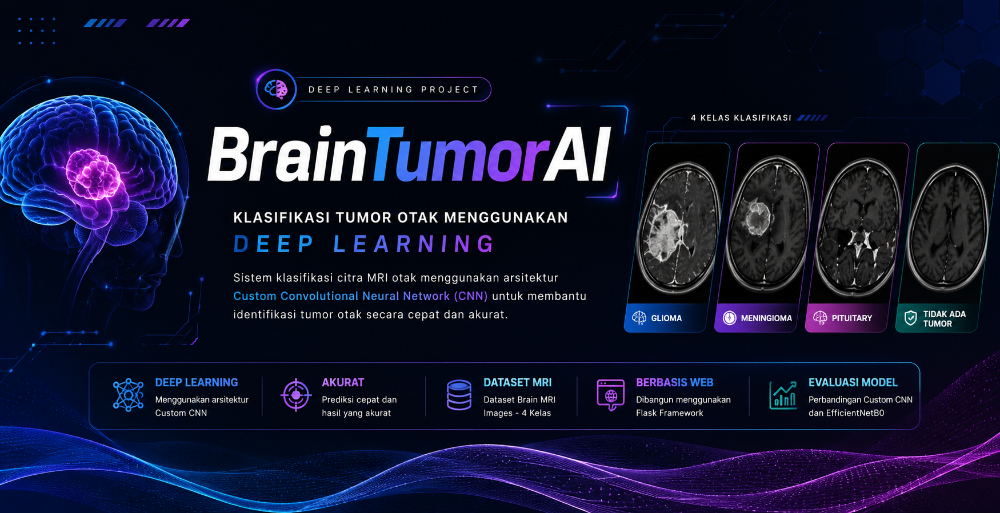

<p align="center">
    
</p>

<h1 align="center">
🧠 BrainTumorAI
</h1>

<p align="center">
Klasifikasi Tumor Otak Menggunakan Deep Learning Berbasis Citra MRI
</p>


---

## Deskripsi Proyek

BrainTumorAI merupakan aplikasi berbasis **Deep Learning** yang dikembangkan sebagai tugas akhir mata kuliah **Kecerdasan Buatan**.

Sistem ini mampu melakukan klasifikasi citra **MRI Otak** ke dalam empat kategori yaitu:

- 🧠 Glioma
- 🧠 Meningioma
- 🧠 Pituitary
- ✅ Tidak Ada Tumor

Model utama yang digunakan adalah **Custom Convolutional Neural Network (CNN)** dan dibandingkan dengan **EfficientNetB0** sebagai model pembanding.

Website dikembangkan menggunakan **Flask Framework** sehingga pengguna dapat melakukan prediksi secara langsung melalui browser.

---

# 👨‍💻 Anggota Kelompok

| Nama | NIM |
|------|-----|
| Rezha Achmad Muharam | 2406081 |
| Faujan Alamsyah | 2406121 |

Institut Teknologi Garut

Program Studi Teknik Informatika

---

# 📂 Struktur Repository

```text
UAS-KecerdasanBuatan/
│
├── README.md
├── Laporan_UAS.md
├── uas_model.ipynb
├── requirements.txt
├── app.py
├── brain_tumor_model.keras
├── class_names.json
│
├── templates/
│   └── index.html
│
├── static/
│   ├── css/
│   ├── js/
│   ├── images/
│   └── uploads/
│
└── data/
    ├── dataset/
    └── Jurnal/
```

---

# 🛠 Framework

- Python 3.12
- Flask
- TensorFlow
- Keras
- OpenCV
- NumPy
- Matplotlib
- Scikit-Learn

---

# 📊 Dataset

Dataset yang digunakan merupakan **Brain MRI Images Dataset** yang terdiri dari **4 kelas**, yaitu:

- Glioma
- Meningioma
- Pituitary
- No Tumor

Dataset digunakan untuk proses training, validasi, dan pengujian model Deep Learning.

---

# 🧠 Model Deep Learning

Model yang digunakan:

- Custom CNN ✅
- EfficientNetB0

Model terbaik kemudian diimplementasikan ke dalam aplikasi web menggunakan Flask.

---

# 📈 Hasil Evaluasi

| Model | Accuracy | Precision | Recall | F1-Score | Keterangan |
|--------|---------:|----------:|--------:|---------:|------------|
| Custom CNN | 76.06% | 77.39% | 76.06% | 74.38% | Model utama yang diimplementasikan pada aplikasi Flask |
| EfficientNetB0 | 25.00% | 6.25% | 25.00% | 10.00% | Model pembanding (belum optimal) |

---

# 🚀 Cara Menjalankan Project

## 1. Clone Repository

```bash
git clone https://github.com/USERNAME/UAS-KecerdasanBuatan.git
```

Masuk ke folder project

```bash
cd UAS-KecerdasanBuatan
```

---

## 2. Buat Virtual Environment (Opsional)

Windows

```bash
py -m venv .venv
```

Aktifkan Virtual Environment

Command Prompt

```bash
.venv\Scripts\activate
```

PowerShell

```powershell
.venv\Scripts\Activate.ps1
```

---

## 3. Install Seluruh Library

> **⚠️ Penting**
>
> Project ini dikembangkan dan diuji menggunakan **Python 3.12.11 (64-bit)**.
>
> Sebelum menginstal library, pastikan Anda telah menginstal Python versi tersebut.
>
> **Download Python 3.12.11:**
>
> - Official Release:
>   https://www.python.org/downloads/release/python-31211/
>
> - Windows Installer (64-bit):
>   https://www.python.org/ftp/python/3.12.11/python-3.12.11-amd64.exe
>
> Saat proses instalasi, **pastikan mencentang opsi _Add python.exe to PATH_**.

Kemudian install seluruh library menggunakan perintah berikut.

```bash
py -m pip install -r requirements.txt
```

Tunggu hingga proses instalasi selesai.

---

## 4. Pastikan File Model Tersedia

Sebelum menjalankan aplikasi, pastikan file model Deep Learning tersedia pada folder utama project.

```text
brain_tumor_model.keras
class_names.json
```

Apabila file `brain_tumor_model.keras` belum tersedia, silakan unduh terlebih dahulu melalui Google Drive berikut:

**📥 Download Model (.keras)**

https://drive.google.com/file/d/1wuhNIglJ-KTFUB83bza-zpj1XCnCdV5F/view?usp=drive_link

Setelah selesai diunduh, letakkan file tersebut pada root project sehingga struktur folder menjadi seperti berikut.

```text
UAS-KecerdasanBuatan/
│
├── app.py
├── brain_tumor_model.keras
├── class_names.json
├── requirements.txt
├── README.md
├── laporan_uas.md
├── uas_model.ipynb
└── ...
```

> **Catatan:** File `brain_tumor_model.keras` tidak disertakan pada repository GitHub karena ukuran file melebihi batas maksimum upload GitHub (100 MB).

---

## 5. Menjalankan Flask

Jalankan perintah berikut

```bash
py app.py
```

Apabila berhasil maka akan muncul

```text
* Running on http://127.0.0.1:5000
```

---

## 6. Membuka Website

Buka browser kemudian akses

```
http://127.0.0.1:5000
```

Website BrainTumorAI akan tampil.

---

## 7. Melakukan Prediksi

1. Masuk ke menu Prediksi
2. Drag & Drop gambar MRI
3. Klik **Prediksi Sekarang**
4. Tunggu proses inferensi selesai
5. Sistem akan menampilkan:

- Hasil Prediksi
- Confidence Score
- Probability setiap kelas
- Deskripsi penyakit

---

# 📚 Referensi

1. TensorFlow Documentation
2. Flask Documentation
3. Brain MRI Images Dataset
4. Scikit-Learn Documentation

---

# 📄 Lisensi

Repository ini dibuat untuk keperluan akademik pada Mata Kuliah Kecerdasan Buatan.

© 2026 Rezha Achmad Muharam & Faujan Alamsyah
