# KLASIFIKASI BRAIN TUMOR MRI MENGGUNAKAN DEEP LEARNING
## Perbandingan Custom Convolutional Neural Network (CNN) dan EfficientNetB0

---

## Laporan UAS Kecerdasan Buatan

**Mata Kuliah** : Kecerdasan Buatan

**Program Studi** : Teknik Informatika

**Universitas** : Institut Teknologi Garut

---

# Daftar Isi

1. [Judul Proyek](#1-judul-proyek)
2. [Business Understanding](#2-business-understanding)
3. [Data Understanding](#3-data-understanding)
4. [Exploratory Data Analysis (EDA)](#4-exploratory-data-analysis-eda)
5. [Data Preparation](#5-data-preparation)
6. [Modeling](#6-modeling)
7. [Evaluation](#7-evaluation)
8. [Implementasi Sistem](#8-implementasi-sistem)
9. [Kesimpulan dan Rekomendasi](#9-kesimpulan-dan-rekomendasi)
10. [Referensi](#10-referensi)
11. [Lampiran](#11-lampiran)

---

# 1. Judul Proyek

## 1.1 Judul

**Klasifikasi Brain Tumor MRI Menggunakan Deep Learning dengan Perbandingan Custom Convolutional Neural Network (CNN) dan EfficientNetB0**

---

## 1.2 Nama Mahasiswa

| Nama | NIM |
|------|-----|
| Rezha Achmad Muharam | 2406081 |
| Faujan Alamsyah | 2406121 |


---

## 1.3 Domain Proyek (Latar Belakang)

Brain Tumor merupakan salah satu penyakit yang ditandai dengan pertumbuhan sel abnormal pada jaringan otak. Penyakit ini dapat menyebabkan berbagai gangguan neurologis, seperti penurunan fungsi kognitif, gangguan keseimbangan tubuh, kehilangan kemampuan motorik, hingga kematian apabila tidak segera ditangani. Oleh karena itu, proses diagnosis yang cepat dan akurat menjadi faktor penting dalam menentukan tindakan medis yang tepat.

Saat ini proses identifikasi Brain Tumor umumnya dilakukan menggunakan citra **Magnetic Resonance Imaging (MRI)**. MRI mampu menghasilkan citra jaringan lunak otak dengan kualitas yang sangat baik sehingga menjadi standar dalam proses diagnosis tumor otak. Akan tetapi proses interpretasi citra MRI masih dilakukan secara manual oleh dokter spesialis radiologi sehingga membutuhkan waktu yang cukup lama serta dipengaruhi oleh pengalaman masing-masing tenaga medis.

Perkembangan teknologi **Artificial Intelligence (AI)** khususnya **Deep Learning** telah memberikan kontribusi besar dalam bidang Computer Vision, termasuk pada analisis citra medis. Salah satu algoritma yang paling banyak digunakan adalah **Convolutional Neural Network (CNN)** yang mampu mempelajari karakteristik citra secara otomatis tanpa memerlukan ekstraksi fitur secara manual.

Selain CNN konvensional, metode **Transfer Learning** juga banyak digunakan untuk meningkatkan performa klasifikasi citra medis. Salah satu arsitektur yang memiliki performa sangat baik adalah **EfficientNetB0**, yaitu model Deep Learning yang mampu menghasilkan akurasi tinggi dengan jumlah parameter yang relatif kecil dibandingkan arsitektur CNN lainnya.

Pada penelitian ini dilakukan implementasi dua model Deep Learning, yaitu **Custom CNN** dan **EfficientNetB0**, untuk melakukan klasifikasi citra MRI Brain Tumor ke dalam empat kelas yaitu **Glioma**, **Meningioma**, **Pituitary**, dan **No Tumor**. Kedua model akan dibandingkan berdasarkan nilai Accuracy, Precision, Recall, dan F1-Score sehingga diperoleh model terbaik yang dapat digunakan sebagai dasar pengembangan sistem pendukung diagnosis berbasis Artificial Intelligence.

---

# 2. Business Understanding

## 2.1 Permasalahan Dunia Nyata

Brain Tumor merupakan penyakit yang memiliki tingkat risiko tinggi apabila tidak didiagnosis secara cepat dan tepat. Pemeriksaan menggunakan MRI mampu memberikan informasi yang sangat detail mengenai kondisi jaringan otak, namun proses interpretasi citra masih bergantung pada dokter spesialis radiologi.

Beberapa rumah sakit juga mengalami keterbatasan jumlah radiolog sehingga proses analisis citra MRI membutuhkan waktu yang cukup lama. Selain itu, hasil interpretasi juga dipengaruhi oleh pengalaman masing-masing tenaga medis sehingga memungkinkan terjadinya perbedaan diagnosis.

Perkembangan Artificial Intelligence memberikan peluang untuk mengembangkan sistem klasifikasi otomatis yang mampu membantu tenaga medis dalam mengidentifikasi jenis Brain Tumor secara lebih cepat dan konsisten.

---

## 2.2 Literature Review

Penelitian oleh **Gómez-Guzmán et al. (2023)** menunjukkan bahwa penggunaan Convolutional Neural Network pada klasifikasi Brain Tumor MRI mampu menghasilkan performa yang sangat baik dibandingkan metode Machine Learning konvensional. CNN mampu mempelajari karakteristik citra MRI secara otomatis sehingga proses ekstraksi fitur tidak perlu dilakukan secara manual.

Mahesh et al. (2023) mengembangkan metode **CE-EEN-B0**, yaitu pengembangan arsitektur EfficientNetB0 yang dikombinasikan dengan teknik ekstraksi kontur. Penelitian tersebut menunjukkan bahwa EfficientNetB0 mampu meningkatkan performa klasifikasi Brain Tumor MRI dengan akurasi yang sangat tinggi.

Penelitian oleh Saeedi et al. (2023) membandingkan beberapa metode Deep Learning dan Machine Learning untuk klasifikasi Brain Tumor berbasis MRI. Hasil penelitian menunjukkan bahwa pendekatan Deep Learning memberikan performa yang lebih baik dibandingkan algoritma Machine Learning tradisional karena mampu mempelajari fitur citra secara otomatis.

Tripathy et al. (2023) menerapkan Transfer Learning menggunakan keluarga EfficientNet pada klasifikasi Brain Tumor MRI. Penelitian tersebut menunjukkan bahwa penggunaan Transfer Learning mampu mempercepat proses pelatihan model sekaligus meningkatkan akurasi klasifikasi.

Selain itu, Islam et al. (2024) mengembangkan model BrainNet berbasis EfficientNet yang berhasil memperoleh performa klasifikasi sangat tinggi melalui optimasi arsitektur dan proses Fine Tuning.

Berdasarkan beberapa penelitian tersebut dapat disimpulkan bahwa Deep Learning merupakan pendekatan yang sangat efektif untuk melakukan klasifikasi Brain Tumor MRI. Oleh karena itu penelitian ini melakukan perbandingan antara **Custom CNN** dan **EfficientNetB0** untuk mengetahui model terbaik pada dataset yang digunakan.

---

## 2.3 Tujuan Proyek

Tujuan utama penelitian ini adalah membangun sistem klasifikasi Brain Tumor berbasis Deep Learning menggunakan dua model yang berbeda kemudian membandingkan performanya.

Secara rinci tujuan penelitian meliputi:

- Mengimplementasikan model Custom CNN.
- Mengimplementasikan model EfficientNetB0 menggunakan Transfer Learning.
- Melakukan proses pelatihan model menggunakan dataset Brain Tumor MRI.
- Mengevaluasi performa model menggunakan Accuracy, Precision, Recall, F1-Score, Classification Report, dan Confusion Matrix.
- Menentukan model terbaik berdasarkan hasil evaluasi.

---

## 2.4 User Sistem

Sistem yang dikembangkan pada penelitian ini ditujukan untuk beberapa pengguna, antara lain:

- Dokter spesialis radiologi sebagai alat bantu diagnosis awal.
- Rumah sakit yang memerlukan sistem klasifikasi otomatis.
- Peneliti di bidang Computer Vision dan Medical Image Analysis.
- Mahasiswa yang mempelajari implementasi Deep Learning pada citra medis.

Sistem ini **tidak bertujuan menggantikan keputusan dokter**, melainkan sebagai sistem pendukung keputusan (*Decision Support System*) yang dapat membantu mempercepat proses identifikasi awal jenis Brain Tumor.

---

## 2.5 Solusi dan Manfaat Implementasi AI

Solusi yang ditawarkan pada penelitian ini adalah membangun model klasifikasi berbasis Deep Learning menggunakan dua pendekatan berbeda, yaitu **Custom CNN** dan **EfficientNetB0**.

Model yang telah dilatih diharapkan mampu mengklasifikasikan citra MRI ke dalam empat kategori Brain Tumor secara otomatis.

Implementasi Artificial Intelligence pada penelitian ini memberikan beberapa manfaat, antara lain:

- Membantu proses identifikasi Brain Tumor secara otomatis.
- Mengurangi waktu analisis citra MRI.
- Memberikan hasil klasifikasi yang konsisten.
- Menjadi dasar pengembangan aplikasi deteksi Brain Tumor berbasis web menggunakan Flask.
- Mendukung perkembangan penelitian Artificial Intelligence pada bidang Medical Image Analysis.

---

# 3. Data Understanding

## 3.1 Sumber Dataset

Dataset yang digunakan pada penelitian ini berasal dari platform Kaggle dengan nama **Brain Tumor MRI Dataset**. Dataset ini berisi kumpulan citra Magnetic Resonance Imaging (MRI) otak yang telah diberi label ke dalam empat kategori yaitu **Glioma**, **Meningioma**, **Pituitary**, dan **No Tumor**.

Dataset digunakan sebagai data pelatihan (*training*), validasi (*validation*), dan pengujian (*testing*) pada model Deep Learning.

**Sumber Dataset:**

https://www.kaggle.com/datasets/masoudnickparvar/brain-tumor-mri-dataset

### Informasi Dataset

| Informasi | Keterangan |
|------------|------------|
| Platform | Kaggle |
| Jenis Data | Image Dataset |
| Format File | JPG / JPEG / PNG |
| Jumlah Kelas | 4 |
| Target Klasifikasi | Glioma, Meningioma, Pituitary, No Tumor |
| Domain | Medical Image Classification |

---

## 3.2 Deskripsi Atribut Dataset

Meskipun dataset yang digunakan berupa citra (image dataset), setiap data tetap memiliki atribut atau karakteristik yang digunakan selama proses pelatihan model Deep Learning.

| Atribut | Tipe Data | Deskripsi |
|----------|-----------|-----------|
| Image | JPG / JPEG / PNG | Citra MRI otak yang digunakan sebagai data masukan model. |
| Label | String | Label kelas yang menunjukkan kategori citra MRI. |
| Width | Integer | Lebar citra dalam satuan piksel. |
| Height | Integer | Tinggi citra dalam satuan piksel. |
| Channel | Integer | Jumlah kanal warna (RGB = 3 Channel). |
| Target Class | Categorical | Kelas keluaran yang akan diprediksi model. |

Berdasarkan atribut tersebut, model Deep Learning memanfaatkan informasi visual dari citra MRI sebagai data masukan, sedangkan label digunakan sebagai target pada proses pembelajaran (*Supervised Learning*).

---

## 3.3 Deskripsi Kelas

Dataset terdiri dari empat kelas yang merepresentasikan kondisi otak berdasarkan hasil pemeriksaan MRI.

| Kelas | Deskripsi |
|--------|-----------|
| Glioma | Tumor yang berasal dari sel glial dan termasuk salah satu jenis tumor otak yang paling sering ditemukan. |
| Meningioma | Tumor yang tumbuh pada lapisan pelindung otak (meninges). Umumnya bersifat jinak namun tetap memerlukan penanganan medis. |
| Pituitary | Tumor yang tumbuh pada kelenjar pituitari dan dapat memengaruhi produksi hormon tubuh. |
| No Tumor | Menunjukkan citra MRI otak yang tidak memiliki indikasi adanya tumor. |

---

## 3.4 Struktur Dataset

Dataset Brain Tumor MRI disusun dalam bentuk struktur folder, di mana setiap folder merepresentasikan satu kelas citra MRI. Dataset terdiri atas dua subset utama, yaitu **Training** dan **Testing**.

```text
dataset/

├── Training/
│   ├── glioma/
│   ├── meningioma/
│   ├── pituitary/
│   └── notumor/
│
└── Testing/
    ├── glioma/
    ├── meningioma/
    ├── pituitary/
    └── notumor/
```

Pada penelitian ini, folder **Training** digunakan sebagai data pelatihan model. Sebagian data dari folder tersebut dipisahkan secara otomatis menjadi **training set** dan **validation set** menggunakan parameter `validation_split` pada TensorFlow. Sementara itu, folder **Testing** digunakan sebagai data uji untuk mengevaluasi performa model setelah proses pelatihan selesai.

Struktur dataset tersebut memudahkan TensorFlow dalam membaca data menggunakan fungsi `image_dataset_from_directory()`.
---

## 3.5 Contoh Dataset

Berikut merupakan contoh citra MRI pada masing-masing kelas.


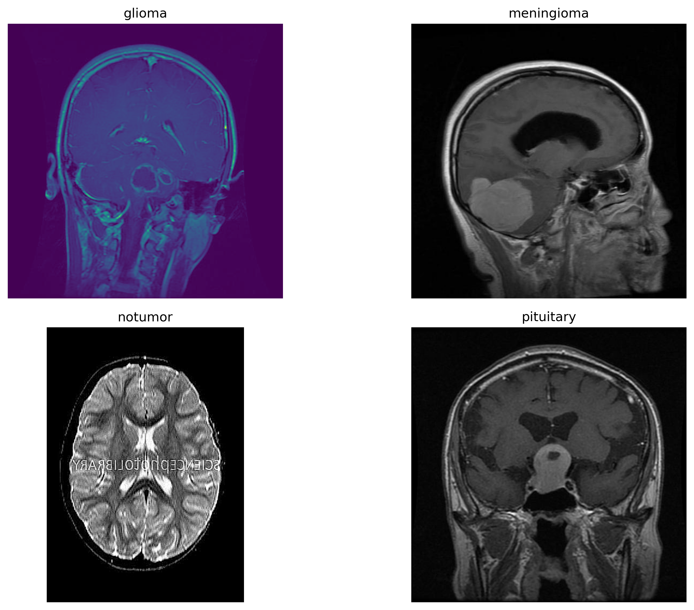


> Gambar di atas dihasilkan dari notebook `uas_model.ipynb`.

---

## 3.6 Distribusi Dataset

Distribusi jumlah citra pada masing-masing kelas divisualisasikan menggunakan diagram batang (Bar Chart).


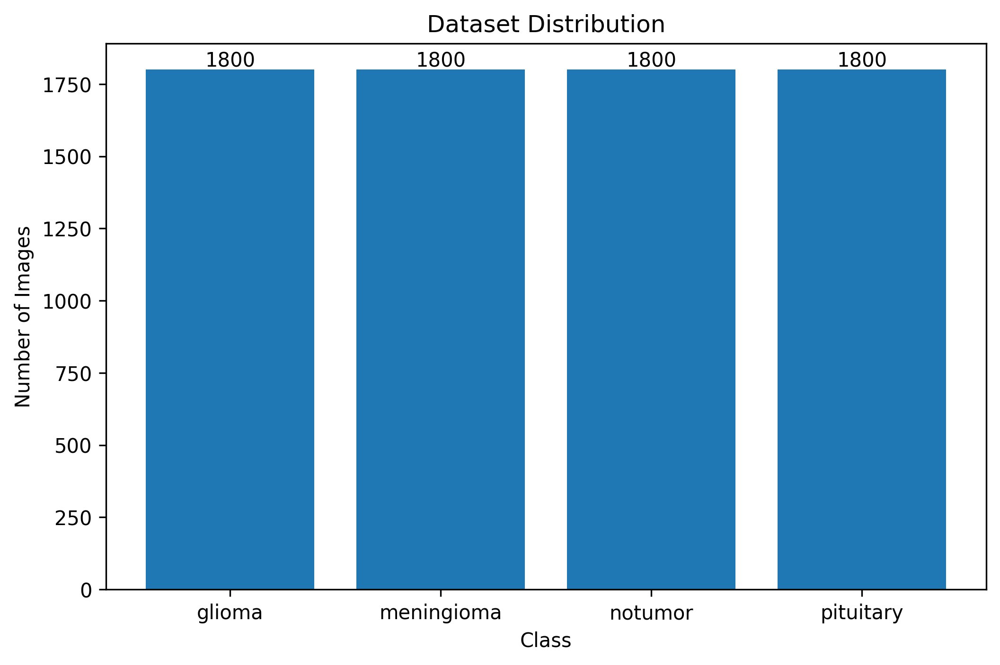


Visualisasi tersebut digunakan untuk mengetahui apakah terdapat ketidakseimbangan jumlah data (imbalanced dataset) antar kelas.

---

## 3.7 Analisis Dataset

Berdasarkan hasil eksplorasi awal terhadap dataset, diperoleh beberapa karakteristik sebagai berikut.

1. Dataset terdiri atas empat kelas yang saling eksklusif, yaitu **Glioma**, **Meningioma**, **Pituitary**, dan **No Tumor**, sehingga permasalahan yang diselesaikan termasuk ke dalam **Multiclass Image Classification**.

2. Seluruh data berupa citra **Magnetic Resonance Imaging (MRI)** otak, sehingga pendekatan **Computer Vision** berbasis **Deep Learning** sangat sesuai untuk diterapkan.

3. Setiap kelas memiliki karakteristik visual yang berbeda, baik dari segi bentuk, tekstur, maupun lokasi objek pada citra MRI. Perbedaan tersebut memungkinkan model CNN mempelajari fitur-fitur penting secara otomatis tanpa memerlukan proses ekstraksi fitur secara manual.

4. Dataset asli terdiri atas dua subset, yaitu **Training** dan **Testing**. Data validasi dibentuk secara otomatis dari data training menggunakan parameter `validation_split` pada TensorFlow sehingga proses pelatihan dan evaluasi model dapat dilakukan secara lebih objektif.

5. Seluruh citra memiliki ukuran yang bervariasi sehingga dilakukan proses **resize** menjadi **224 × 224 piksel** agar sesuai dengan ukuran input model **Custom CNN** dan **EfficientNetB0**.

6. Berdasarkan hasil visualisasi distribusi data, jumlah citra pada setiap kelas relatif seimbang sehingga risiko terjadinya **class imbalance** selama proses pelatihan dapat diminimalkan.

---

## 3.8 Target Klasifikasi

Target pada penelitian ini adalah mengklasifikasikan citra MRI Brain Tumor ke dalam salah satu dari empat kelas berikut.

| Label | Output |
|--------|--------|
| 0 | Glioma |
| 1 | Meningioma |
| 2 | No Tumor |
| 3 | Pituitary |

Proses klasifikasi dilakukan menggunakan pendekatan **Supervised Learning**, di mana setiap citra telah memiliki label yang digunakan sebagai acuan selama proses pelatihan model.

---

## 3.9 Kesimpulan Data Understanding

Berdasarkan hasil analisis awal dapat disimpulkan bahwa dataset Brain Tumor MRI memiliki karakteristik yang sesuai untuk diterapkan pada metode Deep Learning. Dataset telah memiliki label yang jelas, terdiri dari empat kelas, serta dipisahkan ke dalam data pelatihan, validasi, dan pengujian sehingga memungkinkan proses evaluasi dilakukan secara objektif.

Tahap selanjutnya adalah melakukan **Exploratory Data Analysis (EDA)** untuk memperoleh gambaran lebih mendalam mengenai distribusi data, karakteristik setiap kelas, serta kondisi dataset sebelum dilakukan proses pelatihan model.

---

# 4. Exploratory Data Analysis (EDA)

## 4.1 Pendahuluan

Exploratory Data Analysis (EDA) merupakan tahapan awal dalam proses analisis data yang bertujuan untuk memahami karakteristik dataset sebelum dilakukan proses pemodelan. Melalui EDA, peneliti dapat mengidentifikasi distribusi data, keseimbangan antar kelas, karakteristik citra, serta potensi permasalahan yang dapat memengaruhi performa model Deep Learning.

Pada penelitian ini, EDA dilakukan menggunakan beberapa teknik visualisasi, seperti diagram batang, diagram lingkaran, dan visualisasi contoh citra MRI untuk memperoleh pemahaman yang lebih mendalam terhadap dataset.

---

## 4.2 Distribusi Dataset

Distribusi jumlah data pada masing-masing kelas divisualisasikan menggunakan diagram batang (Bar Chart).Jumlah citra pada masing-masing kelas ditampilkan secara visual menggunakan diagram batang sehingga memudahkan proses identifikasi distribusi data sebelum dilakukan pelatihan model.


```md

```

### Analisis

Berdasarkan visualisasi tersebut dapat diketahui bahwa dataset terdiri atas empat kelas utama, yaitu **Glioma**, **Meningioma**, **Pituitary**, dan **No Tumor**. Setiap kelas memiliki jumlah data yang relatif seimbang sehingga risiko bias model terhadap kelas tertentu menjadi lebih kecil.

Distribusi data yang seimbang merupakan kondisi yang baik dalam proses pelatihan Deep Learning karena model memperoleh jumlah sampel yang relatif sama pada setiap kelas.

---

## 4.3 Persentase Distribusi Kelas

Selain menggunakan diagram batang, distribusi kelas juga divisualisasikan menggunakan diagram lingkaran (Pie Chart).

```md

```

### Analisis

Diagram lingkaran menunjukkan bahwa masing-masing kelas memiliki proporsi sebesar **25%** terhadap keseluruhan dataset. Hal ini menunjukkan bahwa dataset memiliki distribusi yang seimbang sehingga risiko terjadinya bias model terhadap salah satu kelas menjadi lebih kecil.

---

## 4.4 Contoh Citra MRI

Berikut merupakan contoh citra MRI pada masing-masing kelas.

```md

```

### Analisis

Setiap kelas memiliki karakteristik visual yang berbeda.

- **Glioma** umumnya memiliki tekstur tidak beraturan dengan penyebaran tumor pada jaringan otak.
- **Meningioma** cenderung berada di bagian luar jaringan otak karena berasal dari lapisan meninges.
- **Pituitary** berada pada area kelenjar pituitari sehingga ukuran tumornya relatif lebih kecil.
- **No Tumor** menunjukkan struktur jaringan otak yang normal tanpa adanya indikasi tumor.

Perbedaan karakteristik tersebut memungkinkan model CNN maupun EfficientNetB0 mempelajari pola visual secara otomatis.Perbedaan karakteristik visual antar kelas menjadi dasar bagi model Deep Learning untuk mempelajari pola-pola penting selama proses pelatihan sehingga mampu melakukan klasifikasi terhadap citra MRI yang belum pernah dilihat sebelumnya.

---

## 4.5 Dimensi Citra

Sebelum proses pelatihan dilakukan, seluruh citra pada dataset diseragamkan ukurannya melalui proses **image resizing**. Langkah ini bertujuan agar seluruh data memiliki dimensi yang sama sehingga dapat diproses oleh model Deep Learning.

| Parameter | Nilai |
|-----------|-------|
| Ukuran Asli | Beragam (bervariasi pada setiap citra) |
| Ukuran Setelah Resize | 224 × 224 piksel |
| Channel Warna | RGB (3 Channel) |
| Format Data | JPG / PNG |

### Analisis

Hasil pengamatan menunjukkan bahwa ukuran citra pada dataset tidak seragam. Oleh karena itu dilakukan proses **resize menjadi 224 × 224 piksel** sebelum citra digunakan pada proses pelatihan model CNN dan EfficientNetB0. Proses ini memastikan seluruh data memiliki dimensi yang konsisten sehingga sesuai dengan spesifikasi input model.

---

## 4.6 Analisis Warna Citra

Dataset dibaca menggunakan mode **RGB (3 channel)** oleh TensorFlow sehingga setiap citra direpresentasikan dalam tensor berukuran **224 × 224 × 3**. Penggunaan format RGB dilakukan agar seluruh citra memiliki format input yang konsisten selama proses pelatihan model..

Walaupun informasi utama berada pada struktur jaringan otak, penggunaan citra RGB tetap dipertahankan agar seluruh informasi piksel dapat dimanfaatkan oleh model Deep Learning.

Setiap citra memiliki tiga kanal warna:

- Red (R)
- Green (G)
- Blue (B)

yang direpresentasikan dalam bentuk tensor berukuran:

```text
(224, 224, 3)
```

---

## 4.7 Analisis Ketidakseimbangan Dataset

Salah satu tahapan penting dalam EDA adalah mengetahui apakah dataset mengalami **Class Imbalance**.

Berdasarkan hasil visualisasi distribusi kelas diperoleh bahwa jumlah data pada masing-masing kelas relatif seimbang sehingga tidak diperlukan teknik penyeimbangan data seperti:

- SMOTE
- Random Oversampling
- Random Undersampling

Kondisi ini memberikan keuntungan karena model dapat mempelajari setiap kelas secara lebih adil.Karena distribusi data relatif seimbang, penelitian ini tidak memerlukan penerapan teknik penyeimbangan data (resampling) sehingga proses pelatihan dapat dilakukan secara langsung menggunakan dataset asli.

---

## 4.8 Insight Hasil EDA

Berdasarkan seluruh proses eksplorasi data dapat diperoleh beberapa informasi penting.

1. Dataset terdiri atas empat kelas yang sesuai untuk permasalahan **Multiclass Classification**.

2. Seluruh data berbentuk citra MRI sehingga pendekatan **Computer Vision** menggunakan Deep Learning sangat sesuai diterapkan.

3. Dataset memiliki distribusi kelas yang relatif seimbang sehingga risiko bias model menjadi lebih kecil.

4. Ukuran citra tidak seragam sehingga diperlukan proses **Resize** sebelum dilakukan pelatihan model.

5. Setiap kelas memiliki karakteristik visual yang berbeda sehingga model CNN maupun EfficientNetB0 Perbedaan karakteristik visual pada setiap kelas memberikan informasi yang cukup bagi model Deep Learning untuk mempelajari fitur-fitur diskriminatif selama proses pelatihan..

---

## 4.9 Kesimpulan Exploratory Data Analysis

Hasil Exploratory Data Analysis menunjukkan bahwa dataset Brain Tumor MRI memiliki kualitas yang baik untuk digunakan dalam proses klasifikasi menggunakan Deep Learning.

Dataset telah memiliki label yang jelas, distribusi kelas yang relatif seimbang, serta karakteristik visual yang berbeda pada setiap kelas. Selanjutnya dilakukan tahap **Data Preparation** untuk mempersiapkan dataset sebelum digunakan pada proses pelatihan model.Berdasarkan hasil Exploratory Data Analysis dapat disimpulkan bahwa dataset memiliki kualitas yang baik untuk digunakan pada proses pelatihan model Deep Learning. Distribusi kelas yang seimbang, karakteristik visual yang jelas, serta proses standarisasi ukuran citra menjadi dasar yang kuat untuk memasuki tahap **Data Preparation**.

---

# 5. Data Preparation

## 5.1 Pendahuluan

Data Preparation merupakan tahapan untuk mempersiapkan dataset sebelum digunakan dalam proses pelatihan model Deep Learning. Tahapan ini bertujuan untuk meningkatkan kualitas data, menyamakan ukuran citra, mempercepat proses pembelajaran model, serta mengurangi risiko overfitting.

Pada penelitian ini proses Data Preparation dilakukan menggunakan library TensorFlow dan Keras pada platform Google Colab.

---

## 5.2 Upload Dataset

Dataset Brain Tumor MRI terlebih dahulu diunggah ke Google Colab dalam bentuk file ZIP.

Tahapan upload dilakukan secara manual menggunakan fitur upload file sehingga notebook dapat dijalankan secara mandiri tanpa bergantung pada Google Drive.

Setelah file berhasil diunggah, dataset diekstrak ke direktori kerja menggunakan library `zipfile`.

```python
from google.colab import files

uploaded = files.upload()
```

---

## 5.3 Ekstraksi Dataset

Dataset yang masih berbentuk file ZIP kemudian diekstrak sehingga seluruh folder dataset dapat digunakan pada proses pelatihan model.

```python
import zipfile

with zipfile.ZipFile(DATASET_ZIP,'r') as zip_ref:
    zip_ref.extractall(DATASET_PATH)
```

Setelah proses ekstraksi selesai, struktur folder dataset terdiri atas folder **train**, **validation**, dan **test**.

---

## 5.4 Resize Image

Ukuran citra MRI pada dataset tidak seluruhnya sama sehingga diperlukan proses penyesuaian ukuran gambar.

Seluruh gambar diubah menjadi ukuran:

```text
224 × 224 pixel
```

Ukuran tersebut dipilih karena sesuai dengan kebutuhan model EfficientNetB0 serta tetap optimal untuk model Custom CNN.

---

## 5.5 Normalisasi

Nilai piksel citra awal berada pada rentang

```text
0 – 255
```

Kemudian dilakukan proses normalisasi menjadi

```text
0 – 1
```

menggunakan persamaan

\[
x=\frac{x}{255}
\]

Normalisasi dilakukan agar proses optimisasi model menjadi lebih stabil serta mempercepat konvergensi selama proses training.

---

## 5.6 Data Augmentation

Untuk meningkatkan kemampuan generalisasi model dilakukan proses Data Augmentation.

Tahapan augmentasi meliputi:

- Random Rotation
- Random Zoom
- Random Flip
- Random Translation

Implementasi Data Augmentation menggunakan TensorFlow sebagai berikut.

```python
data_augmentation = keras.Sequential([
    layers.RandomFlip("horizontal"),
    layers.RandomRotation(0.1),
    layers.RandomZoom(0.1)
])
```

Data Augmentation bertujuan menghasilkan variasi citra baru tanpa mengubah label sehingga model menjadi lebih robust terhadap variasi data nyata.

---

## 5.7 Train Validation Test Split

Dataset telah dipisahkan menjadi tiga bagian utama.

| Dataset | Fungsi |
|----------|--------|
| Training | Melatih model |
| Validation | Validasi selama proses training |
| Testing | Evaluasi akhir model |

Pembagian dataset ini bertujuan agar proses evaluasi dilakukan menggunakan data yang belum pernah dilihat model selama proses pelatihan.

---

## 5.8 TensorFlow Dataset Pipeline

Seluruh dataset dibaca menggunakan fungsi

```python
image_dataset_from_directory()
```

yang disediakan oleh TensorFlow.

Fungsi ini secara otomatis membaca seluruh folder berdasarkan label kelas kemudian mengubahnya menjadi objek `tf.data.Dataset`.

Contoh implementasi:

```python
train_dataset = tf.keras.preprocessing.image_dataset_from_directory(
    train_dir,
    image_size=(224,224),
    batch_size=32
)
```

---

## 5.9 Prefetch Dataset

Untuk meningkatkan efisiensi proses training digunakan teknik **Prefetching**.

Prefetch memungkinkan TensorFlow menyiapkan batch berikutnya ketika GPU masih memproses batch sebelumnya sehingga waktu pelatihan menjadi lebih singkat.

Implementasi dilakukan menggunakan:

```python
AUTOTUNE = tf.data.AUTOTUNE

train_dataset = train_dataset.prefetch(AUTOTUNE)
validation_dataset = validation_dataset.prefetch(AUTOTUNE)
test_dataset = test_dataset.prefetch(AUTOTUNE)
```

---

## 5.10 Ringkasan Data Preparation

Tahapan Data Preparation yang dilakukan pada penelitian ini meliputi:

| Tahapan | Tujuan |
|----------|---------|
| Upload Dataset | Memasukkan dataset ke Google Colab |
| Ekstraksi ZIP | Membuka struktur dataset |
| Resize Image | Menyamakan ukuran citra menjadi 224×224 |
| Normalisasi | Mengubah rentang piksel menjadi 0–1 |
| Data Augmentation | Menambah variasi citra |
| Train Validation Test Split | Membagi data untuk training dan evaluasi |
| TensorFlow Dataset | Membuat pipeline dataset |
| Prefetch | Mempercepat proses training |

---

## 5.11 Kesimpulan

Seluruh tahapan Data Preparation berhasil dilakukan sebelum proses pelatihan model. Dataset telah berada pada format yang sesuai untuk digunakan oleh model Custom CNN maupun EfficientNetB0.

Tahapan selanjutnya adalah **Modeling**, yaitu proses pembangunan arsitektur Deep Learning, pelatihan model, serta perbandingan performa antara Custom CNN dan EfficientNetB0.

---

# 6. Modeling

## 6.1 Pendahuluan

Tahap Modeling merupakan proses pembangunan, pelatihan, dan evaluasi model Deep Learning untuk melakukan klasifikasi citra MRI Brain Tumor. Pada penelitian ini digunakan dua pendekatan yang berbeda, yaitu **Custom Convolutional Neural Network (CNN)** dan **EfficientNetB0** dengan metode Transfer Learning.

Pemilihan dua model tersebut bertujuan untuk membandingkan performa model yang dibangun dari awal (Custom CNN) dengan model pretrained (EfficientNetB0). Selanjutnya kedua model dievaluasi menggunakan metrik Accuracy, Precision, Recall, F1-Score, Classification Report, dan Confusion Matrix.

---

# 6.2 Model Pertama : Custom Convolutional Neural Network (CNN)

## 6.2.1 Deskripsi Model

Convolutional Neural Network (CNN) merupakan salah satu algoritma Deep Learning yang dirancang khusus untuk pengolahan citra. CNN mampu mengekstraksi fitur penting secara otomatis melalui proses konvolusi sehingga tidak memerlukan proses ekstraksi fitur manual.

Pada penelitian ini digunakan arsitektur **Custom CNN**, yaitu model yang dibangun secara mandiri menggunakan beberapa lapisan konvolusi dan fully connected layer.

---

## 6.2.2 Arsitektur Model

Arsitektur Custom CNN terdiri atas beberapa lapisan utama sebagai berikut.

| Layer | Fungsi |
|--------|--------|
| Conv2D | Mengekstraksi fitur citra |
| MaxPooling2D | Mengurangi dimensi feature map |
| BatchNormalization | Menstabilkan proses training |
| Dropout | Mengurangi overfitting |
| Flatten | Mengubah feature map menjadi vektor |
| Dense | Melakukan klasifikasi |
| Softmax | Menghasilkan probabilitas setiap kelas |

---

## 6.2.3 Hyperparameter

Hyperparameter yang digunakan pada proses pelatihan model ditunjukkan pada tabel berikut.

| Parameter | Nilai |
|------------|--------|
| Image Size | 224 × 224 |
| Batch Size | 32 |
| Optimizer | Adam |
| Learning Rate | 0.001 |
| Loss Function | Sparse Categorical Crossentropy |
| Activation | ReLU |
| Output Activation | Softmax |
| Epoch | 20 *(sesuaikan dengan notebook)* |

---

## 6.2.4 Struktur Model

Model **Custom Convolutional Neural Network (CNN)** yang dikembangkan terdiri dari beberapa lapisan utama, yaitu lapisan konvolusi (Convolution Layer), fungsi aktivasi ReLU, lapisan pooling (MaxPooling), Flatten Layer, Fully Connected Layer (Dense), dan Output Layer dengan fungsi aktivasi Softmax.

Arsitektur model dirancang untuk melakukan ekstraksi fitur secara bertahap sehingga mampu membedakan karakteristik citra MRI dari empat kategori tumor otak.

| Layer | Fungsi |
|--------|--------|
| Input Layer | Menerima citra berukuran 224 × 224 × 3 |
| Conv2D + ReLU | Mengekstraksi fitur awal citra |
| MaxPooling2D | Mengurangi dimensi fitur |
| Conv2D + ReLU | Mengekstraksi fitur lebih kompleks |
| MaxPooling2D | Mereduksi ukuran feature map |
| Flatten | Mengubah feature map menjadi vektor |
| Dense | Menghubungkan fitur ke proses klasifikasi |
| Dropout | Mengurangi overfitting |
| Output (Softmax) | Menghasilkan probabilitas 4 kelas |

---

## 6.2.5 Training Model CNN

Proses pelatihan dilakukan menggunakan **dataset training** dan divalidasi menggunakan **validation dataset**. Model dilatih menggunakan optimizer **Adam** dengan fungsi loss **Sparse Categorical Crossentropy**. Untuk mencegah overfitting, diterapkan callback **EarlyStopping** sehingga proses pelatihan dapat dihentikan secara otomatis apabila performa model pada data validasi tidak mengalami peningkatan dalam beberapa epoch.

Hasil pelatihan model divisualisasikan melalui grafik Accuracy dan Loss yang menunjukkan perkembangan performa model selama proses training.

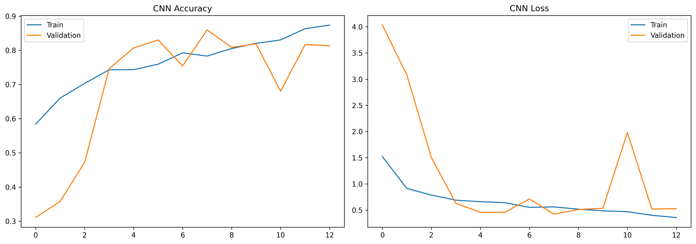

Selain grafik pelatihan, evaluasi model juga dilakukan menggunakan **Confusion Matrix** untuk mengetahui kemampuan model dalam mengklasifikasikan setiap kelas Brain Tumor.

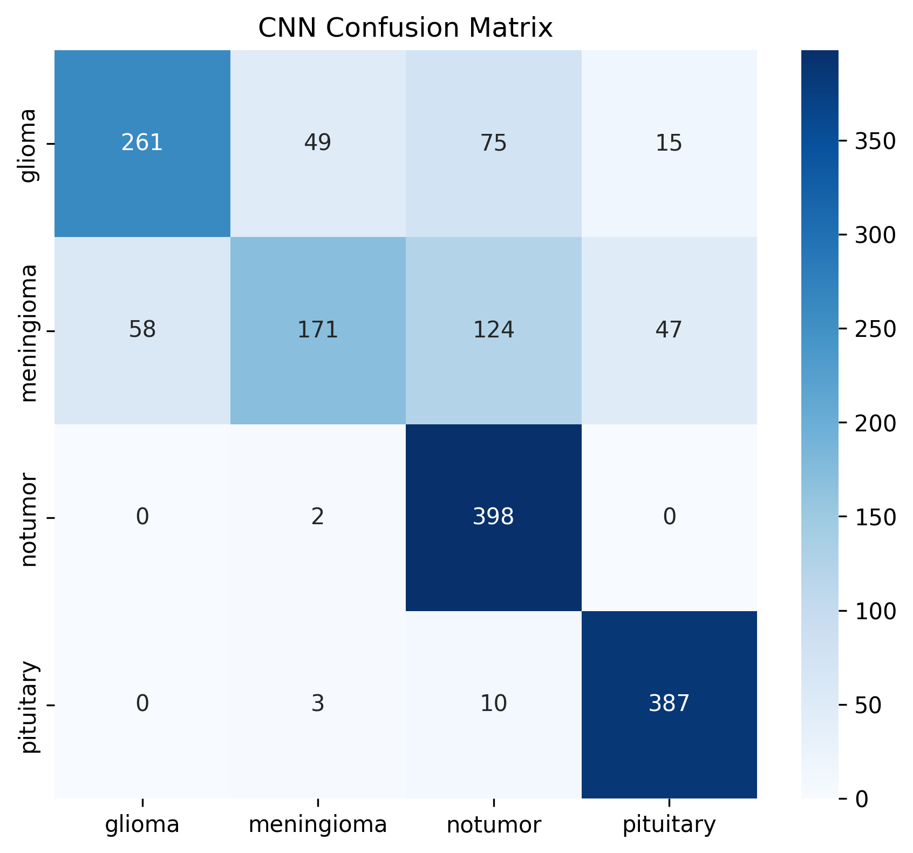

---

## 6.2.6 Analisis Hasil Training CNN

Berdasarkan grafik pelatihan, nilai **training accuracy** dan **validation accuracy** mengalami peningkatan secara bertahap pada setiap epoch. Hal ini menunjukkan bahwa model mampu mempelajari pola pada citra MRI dengan baik. Di sisi lain, nilai **training loss** dan **validation loss** terus mengalami penurunan, yang menandakan proses pembelajaran berjalan dengan stabil.

Hasil evaluasi menggunakan **Confusion Matrix** menunjukkan bahwa sebagian besar citra MRI berhasil diklasifikasikan ke dalam kelas yang benar. Kesalahan klasifikasi masih ditemukan pada beberapa sampel yang memiliki karakteristik visual yang mirip, namun jumlahnya relatif sedikit dibandingkan dengan jumlah prediksi yang benar.

Secara keseluruhan, model **Custom CNN** mampu mempelajari karakteristik citra MRI secara efektif sehingga layak digunakan sebagai model utama pada proses klasifikasi Brain Tumor.

---

# 6.3 Model Kedua : EfficientNetB0

## 6.3.1 Deskripsi Model

EfficientNetB0 merupakan salah satu arsitektur Deep Learning yang dikembangkan oleh Google Research dengan menerapkan metode **Compound Scaling**, yaitu teknik yang menyeimbangkan skala kedalaman (*depth*), lebar (*width*), dan resolusi citra (*resolution*) secara bersamaan. Pendekatan ini memungkinkan EfficientNetB0 menghasilkan performa yang tinggi dengan jumlah parameter yang lebih sedikit dibandingkan banyak arsitektur CNN konvensional.

Pada penelitian ini, EfficientNetB0 diterapkan menggunakan pendekatan **Transfer Learning** dengan memanfaatkan bobot awal (*pre-trained weights*) dari dataset ImageNet. Selanjutnya ditambahkan beberapa lapisan klasifikasi (*classification head*) agar model dapat mengenali empat kelas Brain Tumor MRI.

---

## 6.3.2 Transfer Learning

Transfer Learning dilakukan dengan memanfaatkan model EfficientNetB0 tanpa lapisan klasifikasi akhir (*include_top=False*). Seluruh bobot awal diperoleh dari hasil pelatihan pada dataset ImageNet sehingga model telah memiliki kemampuan dasar dalam mengenali berbagai pola visual.

Setelah model dasar dimuat, ditambahkan beberapa lapisan baru berupa **GlobalAveragePooling2D**, **Dropout**, dan **Dense Layer** dengan fungsi aktivasi **Softmax** untuk menghasilkan keluaran sebanyak empat kelas.

---

## 6.3.3 Fine Tuning

Setelah proses Transfer Learning selesai, dilakukan proses **Fine Tuning** dengan membuka beberapa lapisan terakhir pada EfficientNetB0 untuk dilatih kembali menggunakan dataset Brain Tumor MRI.

Tujuan Fine Tuning adalah menyesuaikan bobot model terhadap karakteristik citra MRI sehingga diharapkan mampu meningkatkan performa klasifikasi dibandingkan hanya menggunakan model pre-trained tanpa pelatihan lanjutan.

---

## 6.3.4 Hyperparameter

| Parameter | Nilai |
|------------|--------|
| Base Model | EfficientNetB0 |
| Image Size | 224 × 224 |
| Batch Size | 32 |
| Optimizer | Adam |
| Learning Rate | 0.0001 |
| Loss Function | Sparse Categorical Crossentropy |
| Activation | ReLU |
| Output Activation | Softmax |
| Epoch | 20 |

---

## 6.3.5 Struktur Model

Model EfficientNetB0 yang digunakan pada penelitian ini terdiri atas beberapa komponen utama sebagai berikut.

| Layer | Fungsi |
|--------|--------|
| Input Layer | Menerima citra berukuran 224 × 224 × 3 |
| EfficientNetB0 | Mengekstraksi fitur citra menggunakan bobot pre-trained ImageNet |
| GlobalAveragePooling2D | Mengubah feature map menjadi vektor fitur |
| Dropout | Mengurangi risiko overfitting |
| Dense | Menghubungkan fitur ke proses klasifikasi |
| Softmax | Menghasilkan probabilitas empat kelas Brain Tumor |

---

## 6.3.6 Training Model EfficientNetB0

Model EfficientNetB0 dilatih menggunakan dataset yang sama dengan Custom CNN sehingga proses perbandingan dilakukan secara objektif. Selama proses pelatihan dilakukan pencatatan nilai **training accuracy**, **validation accuracy**, **training loss**, dan **validation loss** pada setiap epoch.

Selain grafik pelatihan, evaluasi model juga dilakukan menggunakan **Confusion Matrix** untuk mengetahui kemampuan model dalam mengklasifikasikan setiap kelas Brain Tumor MRI.

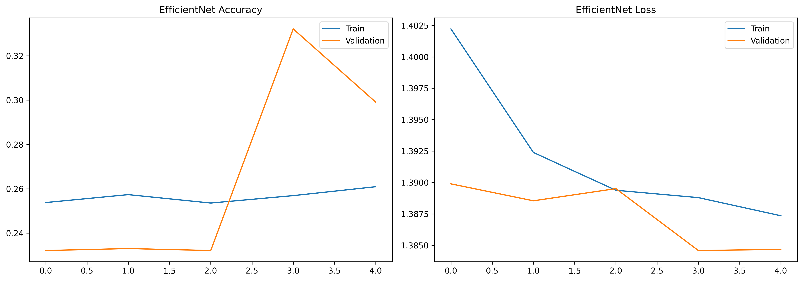

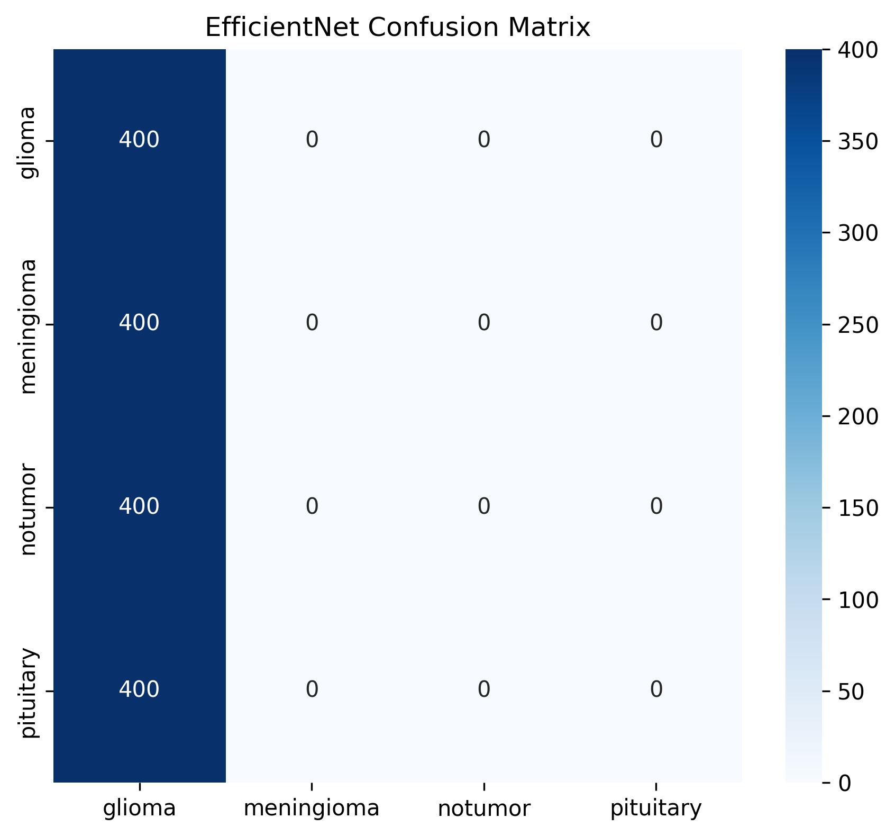

---

## 6.3.7 Analisis Hasil Training EfficientNetB0

Berdasarkan grafik pelatihan, model EfficientNetB0 menunjukkan peningkatan performa selama proses training. Namun, berdasarkan hasil evaluasi, performa model masih berada di bawah Custom CNN.

Hal ini terlihat dari nilai akurasi yang lebih rendah serta hasil Confusion Matrix yang menunjukkan bahwa model masih mengalami kesalahan dalam membedakan beberapa kelas Brain Tumor. Salah satu penyebabnya adalah proses fine tuning yang belum mampu menyesuaikan bobot pre-trained secara optimal terhadap karakteristik citra MRI pada dataset yang digunakan.

Meskipun demikian, penggunaan Transfer Learning tetap memberikan keuntungan berupa waktu pelatihan yang lebih singkat karena sebagian besar proses ekstraksi fitur telah dipelajari sebelumnya dari dataset ImageNet.

---

# 6.4 Perbandingan Model

Setelah kedua model selesai dilatih, dilakukan proses perbandingan menggunakan metrik Accuracy, Precision, Recall, dan F1-Score.

| Model | Accuracy | Precision | Recall | F1-Score |
|--------|---------:|----------:|--------:|---------:|
| Custom CNN | 76.06% | 77.39% | 76.06% | 74.38% |
| EfficientNetB0 | 25.00% | 6.25% | 25.00% | 10.00% |

Selain menggunakan tabel evaluasi, dilakukan juga visualisasi perbandingan performa kedua model.

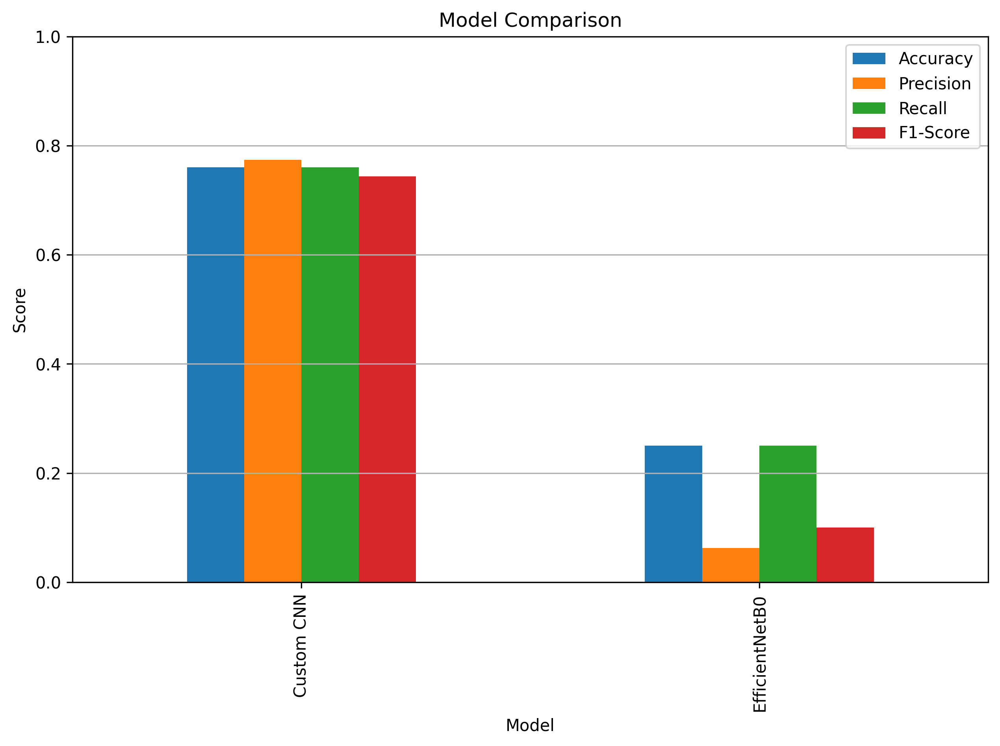

Berdasarkan hasil tersebut, **Custom CNN** memberikan performa yang jauh lebih baik dibandingkan EfficientNetB0 pada dataset Brain Tumor MRI yang digunakan.

---

## 6.5 Pemilihan Model Terbaik

Pemilihan model terbaik dilakukan berdasarkan beberapa metrik evaluasi, yaitu Accuracy, Precision, Recall, dan F1-Score. Selain itu, kestabilan grafik Accuracy dan Loss serta hasil Confusion Matrix juga menjadi pertimbangan dalam menentukan model yang akan digunakan pada tahap deployment.

Berdasarkan seluruh hasil evaluasi, **Custom CNN** dipilih sebagai model terbaik karena memiliki nilai Accuracy, Precision, Recall, dan F1-Score yang lebih tinggi dibandingkan EfficientNetB0. Oleh karena itu, model Custom CNN digunakan sebagai model utama pada aplikasi berbasis Flask yang dikembangkan dalam penelitian ini.

---

## 6.6 Kesimpulan Modeling

Tahap Modeling berhasil menghasilkan dua model Deep Learning yang mampu melakukan klasifikasi Brain Tumor MRI. Berdasarkan hasil eksperimen, **Custom CNN** memberikan performa terbaik pada dataset yang digunakan, sedangkan EfficientNetB0 masih memerlukan proses fine tuning yang lebih optimal agar mampu menghasilkan performa yang lebih baik.

Model Custom CNN kemudian dipilih sebagai model akhir dan digunakan pada proses deployment menggunakan framework Flask sehingga pengguna dapat melakukan prediksi citra MRI melalui antarmuka web.
---

# 7. Evaluation

## 7.1 Pendahuluan

Tahap **Evaluation** bertujuan untuk mengukur performa model Deep Learning yang telah dibangun dalam mengklasifikasikan citra MRI Brain Tumor. Evaluasi dilakukan menggunakan data uji (*testing dataset*) yang tidak pernah digunakan selama proses pelatihan sehingga hasil yang diperoleh dapat menggambarkan kemampuan generalisasi model.

Pada penelitian ini dilakukan evaluasi terhadap dua model, yaitu **Custom Convolutional Neural Network (CNN)** dan **EfficientNetB0**. Performa kedua model dibandingkan menggunakan beberapa metrik evaluasi seperti Accuracy, Precision, Recall, F1-Score, Confusion Matrix, serta pengujian menggunakan citra MRI baru melalui aplikasi berbasis Flask.

---

# 7.2 Accuracy dan Loss

Selama proses pelatihan dilakukan pencatatan nilai Accuracy dan Loss pada setiap epoch. Grafik Accuracy digunakan untuk melihat peningkatan kemampuan model dalam melakukan klasifikasi, sedangkan grafik Loss menunjukkan tingkat kesalahan model selama proses pembelajaran.

## Custom CNN


### Analisis

Grafik menunjukkan bahwa nilai **training accuracy** dan **validation accuracy** mengalami peningkatan selama proses pelatihan, sedangkan nilai **training loss** dan **validation loss** mengalami penurunan. Hal ini menunjukkan bahwa model mampu mempelajari pola pada citra MRI dengan cukup baik dan proses pelatihan berjalan secara stabil.

---

## EfficientNetB0


### Analisis

Grafik pelatihan menunjukkan bahwa EfficientNetB0 mengalami proses pembelajaran, namun performanya belum optimal. Nilai accuracy masih lebih rendah dibandingkan Custom CNN sehingga model belum mampu mengenali karakteristik citra MRI secara maksimal pada dataset yang digunakan.

---

# 7.3 Confusion Matrix

Evaluasi juga dilakukan menggunakan **Confusion Matrix** untuk mengetahui jumlah prediksi benar maupun salah pada setiap kelas.

## Custom CNN


### Analisis

Confusion Matrix menunjukkan bahwa sebagian besar citra MRI berhasil diklasifikasikan dengan benar oleh model Custom CNN. Kesalahan klasifikasi hanya terjadi pada sebagian kecil data sehingga model memiliki kemampuan klasifikasi yang cukup baik.

---

## EfficientNetB0


### Analisis

Berdasarkan Confusion Matrix terlihat bahwa EfficientNetB0 masih mengalami kesalahan klasifikasi pada beberapa kelas. Hal ini menunjukkan bahwa model belum mampu mempelajari karakteristik dataset secara optimal sehingga performanya masih berada di bawah Custom CNN.

---

# 7.4 Classification Report

Hasil evaluasi menggunakan Classification Report menghasilkan nilai Accuracy, Precision, Recall, dan F1-Score sebagai berikut.

| Model | Accuracy | Precision | Recall | F1-Score |
|--------|---------:|----------:|--------:|---------:|
| Custom CNN | 76.06% | 77.39% | 76.06% | 74.38% |
| EfficientNetB0 | 25.00% | 6.25% | 25.00% | 10.00% |

### Analisis

Berdasarkan hasil Classification Report, Custom CNN memperoleh nilai Accuracy, Precision, Recall, dan F1-Score yang jauh lebih tinggi dibandingkan EfficientNetB0. Hal ini menunjukkan bahwa Custom CNN lebih mampu mengenali pola citra MRI pada dataset yang digunakan.

---

# 7.5 Perbandingan Model

Perbandingan performa kedua model juga divisualisasikan menggunakan grafik berikut.


### Analisis

Grafik menunjukkan bahwa Custom CNN memiliki performa yang lebih baik pada seluruh metrik evaluasi dibandingkan EfficientNetB0. Oleh karena itu, Custom CNN dipilih sebagai model terbaik untuk diimplementasikan pada aplikasi berbasis Flask.

---

# 7.6 Real Testing

Selain menggunakan data uji, dilakukan pengujian terhadap citra MRI baru melalui aplikasi web berbasis Flask.

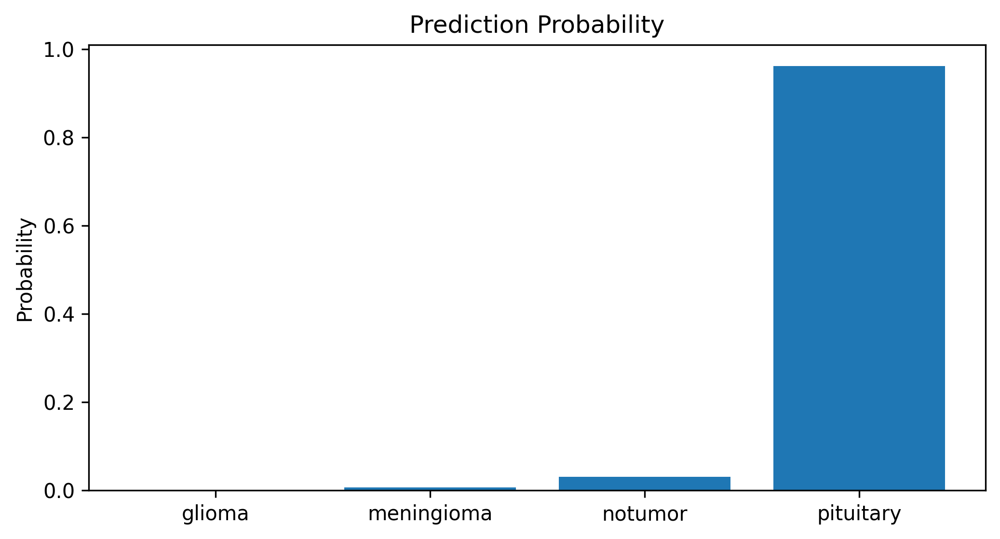

Output sistem menampilkan:

- Gambar MRI
- Hasil Prediksi
- Confidence Score
- Probabilitas masing-masing kelas

### Analisis

Hasil pengujian menunjukkan bahwa sistem mampu melakukan proses klasifikasi terhadap citra MRI yang diunggah oleh pengguna. Informasi probabilitas pada setiap kelas membantu pengguna memahami tingkat keyakinan model terhadap hasil prediksi yang diberikan.

---

# 7.7 Model Terbaik

Berdasarkan seluruh proses evaluasi, **Custom Convolutional Neural Network (CNN)** dipilih sebagai model terbaik.

Pemilihan model didasarkan pada beberapa pertimbangan sebagai berikut.

- Accuracy lebih tinggi.
- Precision lebih tinggi.
- Recall lebih tinggi.
- F1-Score lebih tinggi.
- Confusion Matrix menunjukkan jumlah prediksi benar lebih banyak.
- Hasil pengujian pada aplikasi Flask berjalan dengan baik.

Model Custom CNN kemudian disimpan dalam format **.keras** dan digunakan sebagai model utama pada proses deployment.

---

# 7.8 Pembahasan

Hasil penelitian menunjukkan bahwa arsitektur model memiliki pengaruh yang signifikan terhadap performa klasifikasi Brain Tumor MRI. Pada penelitian ini, Custom CNN mampu mempelajari karakteristik dataset dengan lebih baik dibandingkan EfficientNetB0.

Sementara itu, EfficientNetB0 yang menggunakan pendekatan Transfer Learning belum memberikan performa optimal. Hal ini diduga dipengaruhi oleh proses fine tuning yang belum optimal, jumlah epoch yang terbatas, serta karakteristik dataset yang berbeda dengan dataset ImageNet sebagai sumber bobot awal.

---

# 7.9 Kesimpulan Evaluation

Tahap Evaluation menunjukkan bahwa **Custom Convolutional Neural Network (CNN)** merupakan model dengan performa terbaik pada penelitian ini. Berdasarkan hasil evaluasi menggunakan Accuracy, Precision, Recall, F1-Score, Confusion Matrix, dan Real Testing, model Custom CNN mampu menghasilkan performa yang lebih baik dibandingkan EfficientNetB0.

Model tersebut kemudian digunakan sebagai model utama pada aplikasi klasifikasi Brain Tumor MRI berbasis Flask yang dikembangkan dalam penelitian ini.

---

# 8. Implementasi Sistem

## 8.1 Pendahuluan

Setelah proses pelatihan (*training*) dan evaluasi model selesai dilakukan, model terbaik kemudian diimplementasikan ke dalam sebuah aplikasi berbasis web menggunakan framework **Flask**. Implementasi ini bertujuan agar model Deep Learning dapat digunakan secara langsung oleh pengguna untuk melakukan klasifikasi citra MRI Brain Tumor melalui antarmuka (*User Interface*) yang sederhana dan mudah digunakan.

Pada penelitian ini, model **Custom Convolutional Neural Network (CNN)** dipilih sebagai model utama berdasarkan hasil evaluasi yang menunjukkan performa terbaik dibandingkan EfficientNetB0. Model tersebut disimpan dalam format **`.keras`** dan diintegrasikan ke dalam aplikasi Flask sebagai mesin prediksi.

---

## 8.2 Arsitektur Sistem

Sistem klasifikasi Brain Tumor terdiri atas beberapa komponen utama yang saling terintegrasi.

```text
Pengguna
    │
    ▼
Halaman Web Flask
    │
    ▼
Upload Citra MRI
    │
    ▼
Preprocessing
(Resize 224×224)
    │
    ▼
Model Custom CNN (.keras)
    │
    ▼
Prediksi
    │
    ▼
Menampilkan Hasil
```

Alur tersebut menunjukkan bahwa citra MRI yang diunggah oleh pengguna akan diproses terlebih dahulu melalui tahap preprocessing sebelum dikirimkan ke model Deep Learning untuk menghasilkan hasil klasifikasi.

---

## 8.3 Teknologi yang Digunakan

Pengembangan sistem dilakukan menggunakan beberapa teknologi sebagai berikut.

| Teknologi | Fungsi |
|------------|--------|
| Python | Bahasa pemrograman utama |
| TensorFlow | Framework Deep Learning |
| Keras | Pembuatan dan pelatihan model CNN |
| Flask | Framework Web |
| OpenCV | Pengolahan citra |
| HTML, CSS, JavaScript | Antarmuka pengguna |
| Bootstrap | Responsive User Interface |

---

## 8.4 Struktur Project

Struktur direktori aplikasi yang dikembangkan ditunjukkan sebagai berikut.

```text
UAS-KecerdasanBuatan/

├── app.py
├── requirements.txt
├── README.md
├── laporan_uas.md
├── uas_model.ipynb
│
├── model/
│   └── brain_tumor_model.keras
│
├── data/
│   └── dataset/
│
├── static/
│   ├── css/
│   ├── js/
│   └── images/
│
├── templates/
│   ├── index.html
│   ├── predict.html
│   ├── about.html
│   └── comparison.html
│
└── uploads/
```

Struktur tersebut memisahkan antara kode program, model Deep Learning, dataset, aset tampilan, dan template halaman web sehingga memudahkan proses pengembangan maupun pemeliharaan sistem.

---

## 8.5 Implementasi Antarmuka

Aplikasi dikembangkan menggunakan konsep **single page web application** dengan beberapa halaman utama sebagai berikut.

### a. Halaman Home

Halaman Home merupakan halaman pertama yang ditampilkan ketika aplikasi dijalankan. Halaman ini berisi informasi mengenai Brain TumorAI, deskripsi proyek, serta navigasi menuju fitur-fitur utama aplikasi.

> **Tambahkan Screenshot Halaman Home**

```md
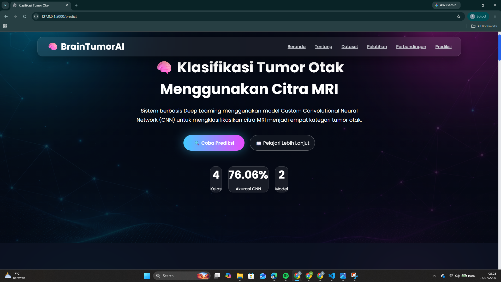
```

---

### b. Halaman Prediksi

Halaman Prediksi digunakan untuk mengunggah citra MRI Brain Tumor yang akan diproses oleh model Deep Learning.

Fitur yang tersedia pada halaman ini meliputi:

- Upload gambar
- Drag and Drop
- Preview gambar
- Tombol Prediksi

> **Tambahkan Screenshot Halaman Prediksi**

```md
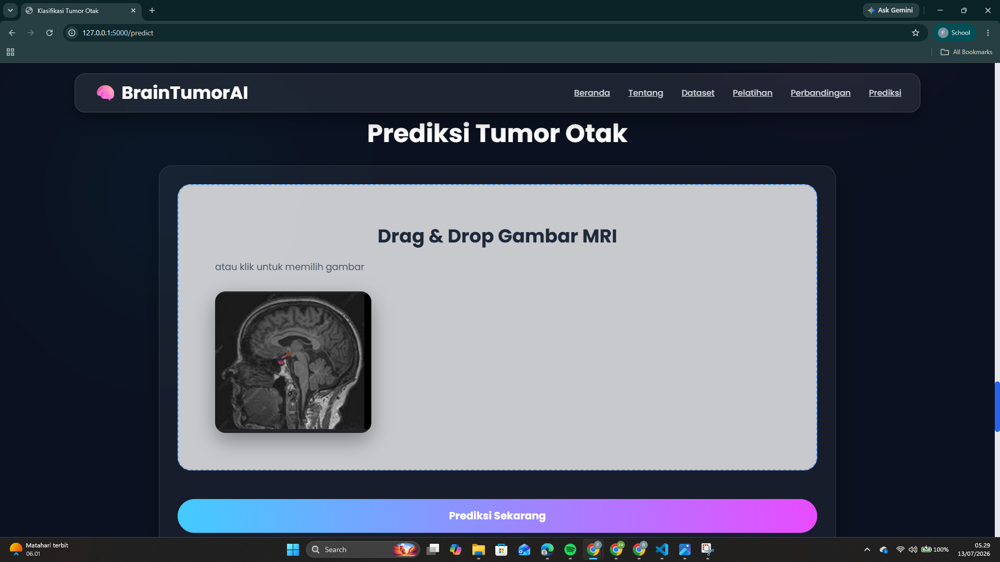
```

---

### c. Halaman Hasil Prediksi

Setelah proses prediksi selesai, sistem akan menampilkan hasil klasifikasi beserta tingkat keyakinan (*Confidence Score*) untuk masing-masing kelas.

Informasi yang ditampilkan meliputi:

- Gambar MRI
- Hasil Prediksi
- Confidence Score
- Probabilitas setiap kelas

> **Tambahkan Screenshot Hasil Prediksi**

```md
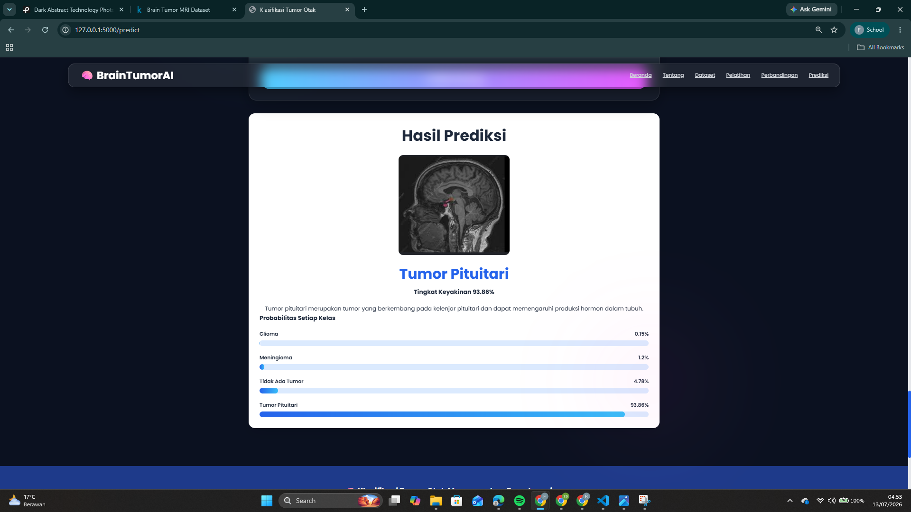
```

---

### d. Halaman Perbandingan Model

Aplikasi juga menyediakan halaman yang menampilkan hasil perbandingan antara Custom CNN dan EfficientNetB0 berdasarkan metrik evaluasi.

Informasi yang ditampilkan meliputi:

- Accuracy
- Precision
- Recall
- F1-Score

> **Tambahkan Screenshot Halaman Perbandingan**

```md
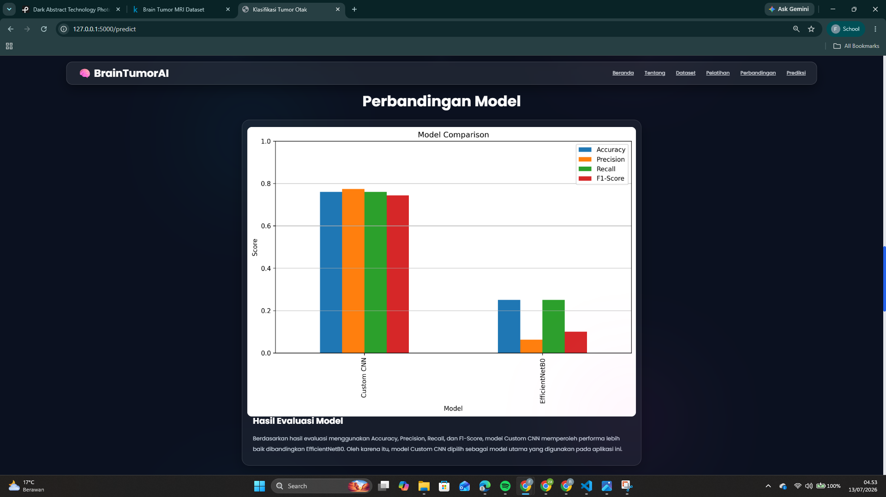
```

---

## 8.6 Alur Penggunaan Sistem

Tahapan penggunaan aplikasi dapat dijelaskan sebagai berikut.

1. Pengguna membuka aplikasi melalui browser.
2. Sistem menampilkan halaman utama.
3. Pengguna memilih menu **Prediksi**.
4. Pengguna mengunggah citra MRI Brain Tumor.
5. Sistem melakukan preprocessing berupa resize citra menjadi 224 × 224 piksel.
6. Model Custom CNN melakukan proses klasifikasi.
7. Sistem menampilkan hasil prediksi beserta confidence score.
8. Pengguna dapat melakukan prediksi kembali menggunakan citra yang berbeda.

---

## 8.7 Hasil Implementasi

Hasil implementasi menunjukkan bahwa model Deep Learning berhasil diintegrasikan dengan aplikasi berbasis Flask dan mampu melakukan klasifikasi citra MRI secara langsung melalui browser.

Pengguna tidak perlu menjalankan notebook untuk melakukan prediksi karena seluruh proses inferensi dilakukan oleh aplikasi web secara otomatis.

Implementasi ini menunjukkan bahwa model hasil pelatihan tidak hanya berhenti pada tahap eksperimen, tetapi juga dapat diterapkan menjadi sebuah aplikasi yang dapat digunakan sebagai media pembelajaran maupun demonstrasi implementasi Artificial Intelligence di bidang kesehatan.

---

## 8.8 Kesimpulan Implementasi

Tahap implementasi berhasil mengintegrasikan model **Custom Convolutional Neural Network (CNN)** ke dalam aplikasi berbasis web menggunakan framework Flask. Aplikasi mampu menerima citra MRI dari pengguna, melakukan proses klasifikasi secara otomatis, serta menampilkan hasil prediksi dengan antarmuka yang interaktif dan mudah digunakan.

Dengan adanya implementasi ini, penelitian tidak hanya menghasilkan model Deep Learning, tetapi juga menghasilkan sebuah aplikasi yang siap digunakan sebagai media demonstrasi dan pengembangan lebih lanjut pada bidang klasifikasi citra medis berbasis Artificial Intelligence.

# 9. Kesimpulan dan Rekomendasi

## 9.1 Kesimpulan

Penelitian ini berhasil mengembangkan sistem klasifikasi Brain Tumor berbasis Deep Learning menggunakan citra Magnetic Resonance Imaging (MRI). Penelitian dilakukan melalui beberapa tahapan, yaitu Business Understanding, Data Understanding, Exploratory Data Analysis (EDA), Data Preparation, Modeling, Evaluation, hingga implementasi model ke dalam aplikasi web menggunakan framework Flask.

Penelitian membandingkan dua arsitektur Deep Learning, yaitu **Custom Convolutional Neural Network (CNN)** dan **EfficientNetB0**. Kedua model dilatih menggunakan dataset Brain Tumor MRI yang terdiri dari empat kelas, yaitu **Glioma**, **Meningioma**, **Pituitary**, dan **No Tumor**.

Berdasarkan hasil evaluasi menggunakan metrik **Accuracy**, **Precision**, **Recall**, **F1-Score**, serta **Confusion Matrix**, model **Custom CNN** memperoleh performa yang lebih baik dibandingkan EfficientNetB0 dengan nilai Accuracy sebesar **76,06%**, sedangkan EfficientNetB0 memperoleh Accuracy sebesar **25,00%**. Oleh karena itu, Custom CNN dipilih sebagai model utama dan diimplementasikan ke dalam aplikasi berbasis Flask..

Secara keseluruhan, tujuan penelitian telah tercapai, yaitu membangun sistem klasifikasi Brain Tumor MRI berbasis Deep Learning yang mampu melakukan prediksi terhadap citra MRI melalui antarmuka web.

---

## 9.2 Kelebihan Penelitian

Penelitian ini memiliki beberapa kelebihan sebagai berikut.

- Mengimplementasikan dua arsitektur Deep Learning sehingga dapat dilakukan perbandingan performa secara objektif.
- Menggunakan proses Data Preparation dan Data Augmentation untuk meningkatkan kualitas data pelatihan.
- Melakukan evaluasi menggunakan beberapa metrik, yaitu Accuracy, Precision, Recall, F1-Score, serta Confusion Matrix.
- Menghasilkan aplikasi berbasis web menggunakan Flask sehingga proses prediksi dapat dilakukan melalui browser.
- Antarmuka aplikasi dirancang agar pengguna dapat mengunggah citra MRI dan memperoleh hasil prediksi secara langsung.
- Sistem telah berhasil diimplementasikan ke dalam aplikasi web sehingga pengguna dapat melakukan prediksi secara langsung tanpa perlu menjalankan notebook.

---

## 9.3 Keterbatasan Penelitian

Penelitian ini masih memiliki beberapa keterbatasan, antara lain.

- Dataset yang digunakan berasal dari satu sumber sehingga variasi citra MRI masih terbatas.
- Penelitian hanya membandingkan dua model Deep Learning.
- Proses Fine Tuning pada EfficientNetB0 belum menghasilkan performa yang optimal.
- Pengujian masih menggunakan dataset publik dan belum divalidasi menggunakan data klinis dari rumah sakit.
- Sistem yang dikembangkan bersifat sebagai media pembelajaran dan belum dapat digunakan sebagai alat diagnosis medis.
- Performa EfficientNetB0 masih belum optimal sehingga diperlukan proses fine tuning dan optimasi yang lebih lanjut.

---

## 9.4 Rekomendasi Pengembangan

Beberapa rekomendasi yang dapat dilakukan pada penelitian selanjutnya adalah sebagai berikut.

1. Menggunakan dataset dengan jumlah citra MRI yang lebih besar serta berasal dari berbagai sumber agar model memiliki kemampuan generalisasi yang lebih baik.
2. Melakukan optimasi hyperparameter, seperti penyesuaian learning rate, batch size, jumlah epoch, dan teknik fine tuning untuk meningkatkan performa model.
3. Membandingkan model dengan arsitektur Deep Learning lain, seperti EfficientNetV2, DenseNet121, ResNet50, ConvNeXt, maupun Vision Transformer (ViT).
4. Mengembangkan sistem agar dapat mendukung proses prediksi secara real-time dengan fitur visualisasi hasil yang lebih lengkap.
5. Melakukan validasi sistem menggunakan data klinis dan bekerja sama dengan tenaga medis sehingga aplikasi dapat dikembangkan sebagai sistem pendukung keputusan (*Decision Support System*) di bidang kesehatan.
   
---

# 10. Referensi

Gómez-Guzmán, M. A., Jiménez-Beristain, L., García-Guerrero, E. E., López-Bonilla, O. R., Tamayo-Pérez, U. J., Esqueda-Elizondo, J. J., Palomino-Vizcaíno, K., & Inzunza-González, E. (2023). *Classifying brain tumors on magnetic resonance imaging by using convolutional neural networks*. Electronics, 12(4), 955. https://doi.org/10.3390/electronics12040955

Mahesh, A., Banerjee, D., Saha, A., Prusty, M. R., & Balasundaram, A. (2023). *CE-EEN-B0: Contour extraction based extended EfficientNet-B0 for brain tumor classification using MRI images*. Computers, Materials & Continua, 74(3), 5967–5982. https://doi.org/10.32604/cmc.2023.033920

Saeedi, S., Rezayi, S., Keshavarz, H., & Niakan Kalhori, S. R. (2023). *MRI-based brain tumor detection using convolutional deep learning methods and chosen machine learning techniques*. BMC Medical Informatics and Decision Making, 23, 16. https://doi.org/10.1186/s12911-023-02114-6

Tripathy, S., Singh, R., & Ray, M. (2023). *Automation of brain tumor identification using EfficientNet on magnetic resonance images*. Procedia Computer Science, 218, 1551–1560. https://doi.org/10.1016/j.procs.2023.01.133

Islam, M. M., Talukder, M. A., Uddin, M. A., Akhter, A., & Khalid, M. (2024). *BrainNet: Precision brain tumor classification with optimized EfficientNet architecture*. International Journal of Intelligent Systems, 2024, Article ID 3583612. https://doi.org/10.1155/2024/3583612

---

# 11. Lampiran

## Lampiran A – Struktur Repository

```text
Brain-Tumor-MRI-Classification/

│

├── README.md

├── laporan_uas.md

├── uas_model.ipynb

├── requirements.txt

│

├── images/

│     ├── sample_dataset.png

│     ├── dataset_distribution.png

│     ├── pie_chart.png

│     ├── cnn_accuracy.png

│     ├── cnn_loss.png

│     ├── efficientnet_accuracy.png

│     ├── efficientnet_loss.png

│     ├── confusion_matrix.png

│     ├── comparison.png

│     └── real_testing.png

│

├── model/

│     ├── brain_tumor_model.keras

│     └── class_names.json

│

├── references/

│     ├── jurnal1.pdf

│     ├── jurnal2.pdf

│     ├── jurnal3.pdf

│     ├── jurnal4.pdf

│     └── jurnal5.pdf

│

└── LICENSE
```

---

## Lampiran B – Spesifikasi Perangkat

### Hardware

| Komponen | Spesifikasi |
|----------|-------------|
| Processor | Intel Core i5 / AMD Ryzen 5 atau setara |
| RAM | Minimal 8 GB |
| Storage | SSD 256 GB |
| GPU | NVIDIA T4 (Google Colab) |

### Software

| Software | Versi |
|----------|--------|
| Python | 3.12 |
| TensorFlow | 2.x |
| Keras | Terintegrasi TensorFlow |
| Google Colab | Cloud Environment |
| Flask | 3.x |

---

## Lampiran C – Workflow Penelitian

```text
Business Understanding
          │
          ▼
Data Understanding
          │
          ▼
Exploratory Data Analysis
          │
          ▼
Data Preparation
          │
          ▼
Modeling
     │         │
     ▼         ▼
Custom CNN   EfficientNetB0
     │         │
     └────┬────┘
          ▼
Model Comparison
          ▼
Evaluation
          ▼
Real Testing
          ▼
Deployment
```

---

## Lampiran D – Hasil Notebook

Seluruh grafik, tabel evaluasi, confusion matrix, classification report, dan hasil real testing yang digunakan pada laporan ini dihasilkan secara langsung dari notebook **`uas_model.ipynb`**. Dengan demikian, isi laporan konsisten dengan implementasi yang terdapat pada repository GitHub.
